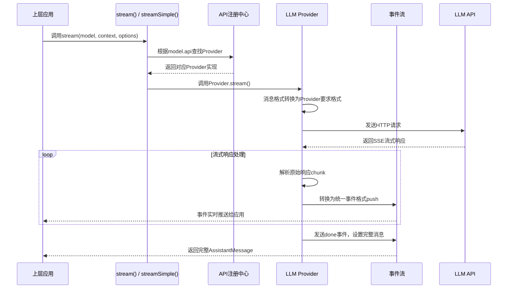
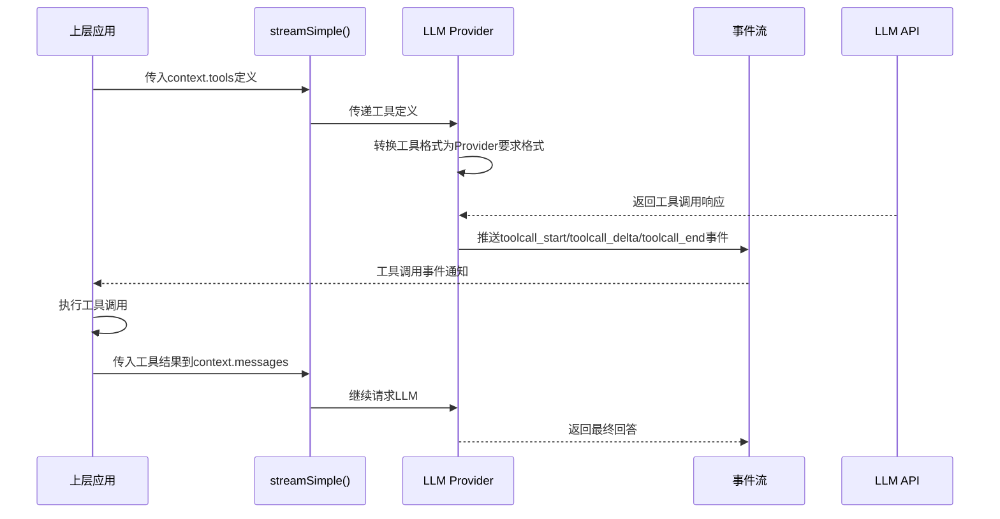
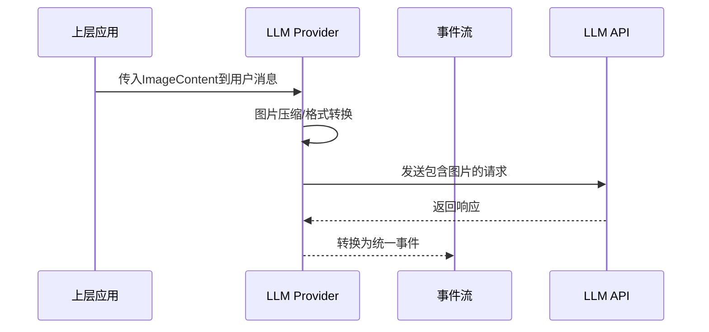

# pi-ai 实现架构全解析

## 一、整体架构设计
pi-ai 是一个高度抽象的 LLM 统一接入层，采用四层架构设计，屏蔽不同 LLM 提供商的差异，提供统一的 API 接口：

```mermaid
flowchart TD
    A[上层应用<br/>(agent/core/coding-agent等)] --> B[API层<br/>统一入口函数]
    B --> C[核心层<br/>类型系统+事件流+模型管理]
    C --> D[Provider适配层<br/>20+ LLM提供商适配]
    D --> E[LLM服务商API<br/>(OpenAI/Anthropic/Google/Bedrock等)]
    
    subgraph 核心能力
        C1[类型系统: 统一消息/事件/工具定义]
        C2[事件流: 标准化流式响应事件]
        C3[模型管理: 798+模型元数据管理]
        C4[API注册: Provider动态注册机制]
        C5[OAuth认证: 多平台身份认证]
    end
    
    subgraph 特性支持
        F1[统一工具调用]
        F2[多模态输入(文本/图片)]
        F3[思考链支持]
        F4[Prompt缓存]
        F5[自动重试/错误处理]
        F6[Token计费计算]
    end
```

## 二、核心类与接口关系
```mermaid
classDiagram
    class Model {
        <<interface>>
        +id: string
        +name: string
        +api: Api
        +provider: Provider
        +baseUrl: string
        +reasoning: boolean
        +input: ("text" | "image")[]
        +cost: Cost
        +contextWindow: number
        +maxTokens: number
    }
    
    class Message {
        <<interface>>
        +role: "user" | "assistant" | "toolResult"
        +timestamp: number
    }
    
    class UserMessage {
        <<interface>>
        +content: string | (TextContent | ImageContent)[]
    }
    
    class AssistantMessage {
        <<interface>>
        +content: (TextContent | ThinkingContent | ToolCall)[]
        +api: Api
        +provider: Provider
        +model: string
        +usage: Usage
        +stopReason: StopReason
    }
    
    class ToolResultMessage {
        <<interface>>
        +toolCallId: string
        +toolName: string
        +content: (TextContent | ImageContent)[]
        +isError: boolean
    }
    
    class Context {
        <<interface>>
        +systemPrompt?: string
        +messages: Message[]
        +tools?: Tool[]
    }
    
    class Tool {
        <<interface>>
        +name: string
        +description: string
        +parameters: TSchema
    }
    
    class AssistantMessageEventStream {
        <<class>>
        +next()
        +return()
        +throw()
        +result(): Promise<AssistantMessage>
        +[Symbol.asyncIterator]()
    }
    
    class StreamFunction {
        <<interface>>
        (model: Model, context: Context, options?: StreamOptions): AssistantMessageEventStream
    }
    
    Message <|-- UserMessage
    Message <|-- AssistantMessage
    Message <|-- ToolResultMessage
    
    Context "1" *-- "*" Message
    Context "*" o-- "*" Tool
    
    StreamFunction --> AssistantMessageEventStream
    StreamFunction --> Model
    StreamFunction --> Context
```

### 核心接口说明
| 接口/类 | 定义位置 | 核心功能 |
|---------|----------|----------|
| `Model` | [src/types.ts#L300](file:///d:/prj/pi-mono-analysis/packages/ai/src/types.ts#L300) | 统一的模型元数据定义，包含能力、价格、上下文窗口等信息 |
| `Message` | [src/types.ts#L186](file:///d:/prj/pi-mono-analysis/packages/ai/src/types.ts#L186) | 统一的消息类型，涵盖用户、助理、工具结果三种角色 |
| `Context` | [src/types.ts#L225](file:///d:/prj/pi-mono-analysis/packages/ai/src/types.ts#L225) | LLM 请求上下文，包含系统提示、消息历史、工具定义 |
| `AssistantMessageEventStream` | [src/utils/event-stream.ts](file:///d:/prj/pi-mono-analysis/packages/ai/src/utils/event-stream.ts) | 异步迭代器流式响应，标准化所有 LLM 的输出格式 |
| `StreamFunction` | [src/types.ts#L118](file:///d:/prj/pi-mono-analysis/packages/ai/src/types.ts#L118) | Provider 实现接口，所有 LLM 提供商都需要实现这个接口 |

## 三、核心模块实现

### 1. 事件流系统 [src/utils/event-stream.ts]
```typescript
export class AssistantMessageEventStream
  implements AsyncIterableIterator<AssistantMessageEvent>
{
  private readonly _events: AssistantMessageEvent[] = [];
  private _resolve?: (value: AssistantMessage) => void;
  private _reject?: (reason?: any) => void;
  private readonly _result: Promise<AssistantMessage>;

  constructor() {
    this._result = new Promise((resolve, reject) => {
      this._resolve = resolve;
      this._reject = reject;
    });
  }

  // 推送事件到流中
  push(event: AssistantMessageEvent): void {
    this._events.push(event);
    // 通知等待的迭代器
    if (this._waiter) {
      this._waiter();
      this._waiter = undefined;
    }
  }

  // 异步迭代器实现
  async next(): Promise<IteratorResult<AssistantMessageEvent>> {
    // 事件处理逻辑
  }

  // 获取最终完整消息
  async result(): Promise<AssistantMessage> {
    return this._result;
  }

  [Symbol.asyncIterator](): AsyncIterableIterator<AssistantMessageEvent> {
    return this;
  }
}
```
**设计亮点**：
- 统一所有 LLM 提供商的流式输出格式
- 支持异步迭代，可直接使用 `for await...of` 遍历
- 内置 Promise，可通过 `result()` 等待完整响应
- 事件驱动，支持实时处理增量输出

### 2. 模型管理系统 [src/models.ts]
```typescript
const modelRegistry: Map<string, Map<string, Model<Api>>> = new Map();

// 初始化时加载所有预定义模型
for (const [provider, models] of Object.entries(MODELS)) {
  const providerModels = new Map<string, Model<Api>>();
  for (const [id, model] of Object.entries(models)) {
    providerModels.set(id, model as Model<Api>);
  }
  modelRegistry.set(provider, providerModels);
}

// 根据提供商和模型ID获取模型
export function getModel<TProvider extends KnownProvider, TModelId extends keyof (typeof MODELS)[TProvider]>(
  provider: TProvider,
  modelId: TModelId,
): Model<ModelApi<TProvider, TModelId>> {
  const providerModels = modelRegistry.get(provider);
  return providerModels?.get(modelId as string) as Model<ModelApi<TProvider, TModelId>>;
}

// 计算请求费用
export function calculateCost<TApi extends Api>(model: Model<TApi>, usage: Usage): Usage["cost"] {
  usage.cost.input = (model.cost.input / 1000000) * usage.input;
  usage.cost.output = (model.cost.output / 1000000) * usage.output;
  usage.cost.cacheRead = (model.cost.cacheRead / 1000000) * usage.cacheRead;
  usage.cost.cacheWrite = (model.cost.cacheWrite / 1000000) * usage.cacheWrite;
  usage.cost.total = usage.cost.input + usage.cost.output + usage.cost.cacheRead + usage.cost.cacheWrite;
  return usage.cost;
}
```
**特性**：
- 内置 798+ 支持工具调用的模型元数据
- 支持自动计算请求费用（美元）
- 支持模型能力检测（多模态、思考能力等）
- 自动生成脚本同步最新模型列表：[scripts/generate-models.ts](file:///d:/prj/pi-mono-analysis/packages/ai/scripts/generate-models.ts)

### 3. 流处理核心 [src/stream.ts]
```typescript
// 底层流接口，使用Provider原生参数
export function stream<TApi extends Api>(
  model: Model<TApi>,
  context: Context,
  options?: ProviderStreamOptions,
): AssistantMessageEventStream {
  const provider = resolveApiProvider(model.api);
  return provider.stream(model, context, options as StreamOptions);
}

// 简单流接口，统一参数格式，自动适配不同Provider
export function streamSimple<TApi extends Api>(
  model: Model<TApi>,
  context: Context,
  options?: SimpleStreamOptions,
): AssistantMessageEventStream {
  const provider = resolveApiProvider(model.api);
  return provider.streamSimple(model, context, options);
}

// 非流式接口，等待完整响应
export async function complete<TApi extends Api>(
  model: Model<TApi>,
  context: Context,
  options?: ProviderStreamOptions,
): Promise<AssistantMessage> {
  const s = stream(model, context, options);
  return s.result();
}
```
**设计特点**：
- 提供两层API：底层 `stream` 支持 Provider 特定参数，上层 `streamSimple` 统一参数格式
- 自动路由到对应的 Provider 实现
- 统一错误处理，所有异常都通过事件流返回
- 支持请求中断（`AbortSignal`）

### 4. Provider 动态注册机制 [src/api-registry.ts]
```typescript
const apiRegistry = new Map<Api, ApiProvider>();

export interface ApiProvider {
  stream: StreamFunction;
  streamSimple: (
    model: Model,
    context: Context,
    options?: SimpleStreamOptions,
  ) => AssistantMessageEventStream;
  mapOptions?: (
    model: Model,
    context: Context,
    options: SimpleStreamOptions,
  ) => ProviderStreamOptions;
}

export function registerApiProvider(api: Api, provider: ApiProvider): void {
  apiRegistry.set(api, provider);
}

export function getApiProvider(api: Api): ApiProvider | undefined {
  return apiRegistry.get(api);
}
```
**扩展能力**：
- 支持动态注册新的 LLM 提供商
- 无需修改核心代码即可扩展支持新的 API
- 支持 Provider 特定的参数映射逻辑

## 四、主要场景实现流程

### 1. 基础 LLM 请求流程

**关键代码示例**：
```typescript
// 基础使用示例
import { getModel, stream } from "@mariozechner/pi-ai";

// 获取指定模型
const model = getModel("anthropic", "claude-3-5-sonnet-20240620");

// 构造请求上下文
const context = {
  systemPrompt: "你是一个 helpful 的助手",
  messages: [
    {
      role: "user",
      content: "Hello, world!",
      timestamp: Date.now(),
    },
  ],
};

// 发起流式请求
const eventStream = stream(model, context);
for await (const event of eventStream) {
  switch (event.type) {
    case "text_delta":
      process.stdout.write(event.delta); // 实时输出文本增量
      break;
    case "toolcall_end":
      console.log(`\n调用工具: ${event.toolCall.name}`);
      break;
  }
}

// 获取完整响应
const finalMessage = await eventStream.result();
console.log(`\n总Token消耗: ${finalMessage.usage.totalTokens}`);
```

### 2. 工具调用流程

**工具定义示例**：
```typescript
import { Type } from "@mariozechner/pi-ai";

const tools = [
  {
    name: "get_weather",
    description: "获取指定城市的天气",
    parameters: Type.Object({
      city: Type.String({ description: "城市名称" }),
      date: Type.Optional(Type.String({ description: "日期，默认今天" })),
    }),
  },
];
```

### 3. 多模态请求流程

**多模态请求示例**：
```typescript
const context = {
  messages: [
    {
      role: "user",
      content: [
        { type: "text", text: "这张图片里有什么?" },
        {
          type: "image",
          data: fs.readFileSync("image.jpg", "base64"),
          mimeType: "image/jpeg",
        },
      ],
      timestamp: Date.now(),
    },
  ],
};
```

## 五、Provider 适配层实现（以OpenAI Responses API为例）
**代码位置**：[src/providers/openai-responses.ts](file:///d:/prj/pi-mono-analysis/packages/ai/src/providers/openai-responses.ts)
```typescript
export const streamOpenAIResponses: StreamFunction = (model, context, options) => {
  const stream = new AssistantMessageEventStream();
  
  (async () => {
    // 1. 初始化输出消息
    const output: AssistantMessage = {
      role: "assistant",
      content: [],
      api: model.api,
      provider: model.provider,
      model: model.id,
      usage: { input: 0, output: 0, cacheRead: 0, cacheWrite: 0, totalTokens: 0, cost: {} },
      stopReason: "stop",
      timestamp: Date.now(),
    };
    
    // 2. 推送start事件
    stream.push({ type: "start", partial: output });
    
    // 3. 转换上下文为OpenAI格式
    const messages = convertContextToOpenAIMessages(context);
    
    // 4. 调用OpenAI API
    const openaiStream = await client.responses.create({
      model: model.id,
      messages,
      tools: convertToolsToOpenAI(context.tools),
      stream: true,
      ...options,
    });
    
    // 5. 处理流式响应
    for await (const chunk of openaiStream) {
      switch (chunk.type) {
        case "response.output_text.delta":
          // 转换为text_delta事件
          output.content[0].text += chunk.delta;
          stream.push({
            type: "text_delta",
            contentIndex: 0,
            delta: chunk.delta,
            partial: output,
          });
          break;
        case "response.function_call_arguments.delta":
          // 转换为toolcall_delta事件
          break;
        // ... 其他事件处理
      }
    }
    
    // 6. 推送done事件
    stream.push({ type: "done", reason: "stop", message: output });
  })();
  
  return stream;
};
```

## 六、内置支持的 LLM 提供商
| 提供商 | API类型 | 代码路径 |
|--------|---------|----------|
| Anthropic | anthropic-messages | [src/providers/anthropic.ts](file:///d:/prj/pi-mono-analysis/packages/ai/src/providers/anthropic.ts) |
| OpenAI Responses | openai-responses | [src/providers/openai-responses.ts](file:///d:/prj/pi-mono-analysis/packages/ai/src/providers/openai-responses.ts) |
| Azure OpenAI | azure-openai-responses | [src/providers/azure-openai-responses.ts](file:///d:/prj/pi-mono-analysis/packages/ai/src/providers/azure-openai-responses.ts) |
| OpenAI Completions | openai-completions | [src/providers/openai-completions.ts](file:///d:/prj/pi-mono-analysis/packages/ai/src/providers/openai-completions.ts) |
| Google Gemini | google-generative-ai | [src/providers/google.ts](file:///d:/prj/pi-mono-analysis/packages/ai/src/providers/google.ts) |
| Google Vertex AI | google-vertex | [src/providers/google-vertex.ts](file:///d:/prj/pi-mono-analysis/packages/ai/src/providers/google-vertex.ts) |
| Amazon Bedrock | bedrock-converse-stream | [src/providers/amazon-bedrock.ts](file:///d:/prj/pi-mono-analysis/packages/ai/src/providers/amazon-bedrock.ts) |
| Mistral | mistral-conversations | [src/providers/mistral.ts](file:///d:/prj/pi-mono-analysis/packages/ai/src/providers/mistral.ts) |
| OpenRouter | openai-responses | 兼容OpenAI协议 |
| Vercel AI Gateway | openai-responses | 兼容OpenAI协议 |

## 七、核心设计亮点
1. **完全抽象**：所有 LLM 提供商差异被完全屏蔽，上层应用无需关心底层实现
2. **全流式设计**：所有 API 都是流式的，支持实时响应，无阻塞等待
3. **类型安全**：完整的 TypeScript 类型定义，所有参数和返回值都有类型校验
4. **易扩展**：动态注册机制，新增 LLM 提供商无需修改核心代码
5. **高性能**：轻量级封装，几乎无额外性能开销
6. **统一工具调用**：所有支持工具调用的模型都使用相同的工具定义格式
7. **内置计费**：自动计算请求费用，支持成本控制
