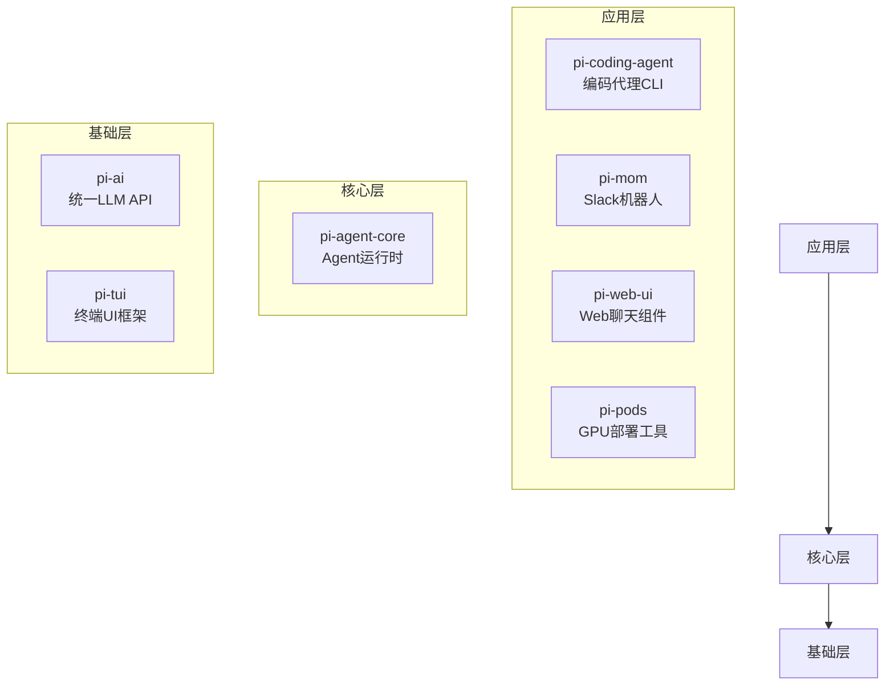
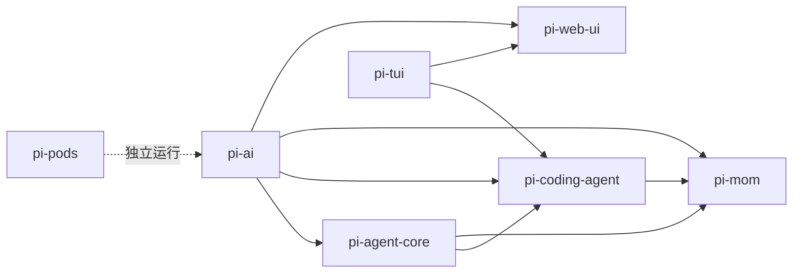
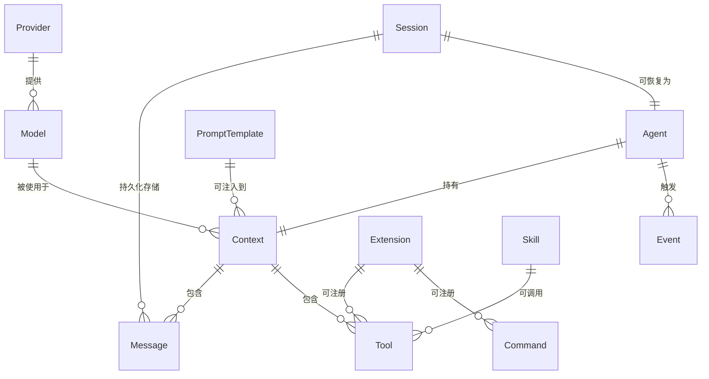
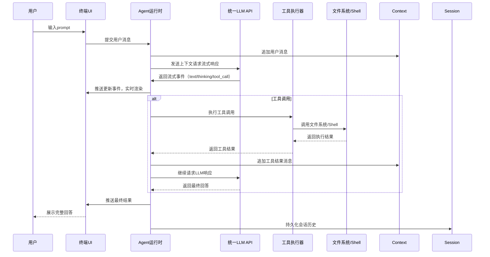
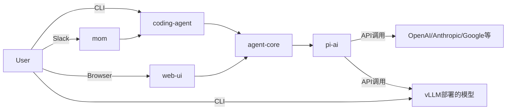

# Pi 项目技术架构总览

## 整体定位
Pi 是一个全栈 AI Agent 开发平台，专注于构建可扩展的 AI 代理和编码助手，采用 Monorepo 架构，所有包使用锁步版本控制（版本号统一）。核心设计理念是**最小核心+极致扩展**，通过插件化的方式支持自定义工作流，而不强制用户使用特定模式。

---

## 组件分层架构

### 分层结构图

---

## 各组件详细职责

### 1. 基础层

#### 📦 @mariozechner/pi-ai
**定位**：统一多提供商 LLM API 抽象层
- 支持20+ LLM 提供商（OpenAI、Anthropic、Google、Bedrock、GitHub Copilot、OpenRouter 等）
- 统一的流式响应事件格式（text、tool_call、thinking、usage 等标准化事件）
- 自动模型发现、token 计数、成本跟踪
- 内置工具调用验证、上下文序列化、跨提供商无缝切换
- 支持 OAuth 认证流程，无需硬编码 API Key
- 自动处理上下文溢出，支持跨模型会话交接

#### 📦 @mariozechner/pi-tui
**定位**：高性能终端 UI 框架
- 差分渲染+同步输出技术，实现无闪烁终端交互
- 内置常用组件：Editor、Markdown 渲染器、选择列表、设置面板、图片渲染等
- 支持 IME（输入法编辑器）、自动补全、快捷键绑定
- 支持 Kitty/iTerm2 图片协议，可在终端内渲染图片
- 支持模态框、悬浮层、响应式布局
- 提供可扩展的主题系统

---

### 2. 核心层

#### 📦 @mariozechner/pi-agent-core
**定位**：通用 Agent 运行时
- 基于 pi-ai 构建，提供状态管理、工具执行、事件流能力
- 支持并行/顺序工具执行模式，内置工具调用前置/后置钩子
- 事件驱动架构，提供完整的生命周期事件（agent_start、message_update、tool_execution 等）
- 支持自定义消息类型，可扩展自定义 Agent 能力
- 内置上下文转换层，支持将应用层消息转换为 LLM 可识别格式
- 支持 steering 消息（中断当前执行）和 follow-up 消息（队列后续任务）
- 提供低级别 agentLoop API，方便自定义 Agent 流程

---

### 3. 应用层

#### 📦 @mariozechner/pi-coding-agent
**定位**：交互式终端编码代理（核心产品）
- 基于 agent-core 和 tui 构建，是用户直接使用的 CLI 工具
- 内置核心工具：read、write、edit、bash、grep、find、ls
- 支持会话持久化、分支回溯、上下文自动压缩
- 高度可扩展：支持 Extensions（TypeScript 扩展）、Skills（Agent 技能）、Prompt Templates（提示词模板）、Themes（主题）
- 支持 Pi Packages，可通过 npm/git 安装共享扩展能力
- 多种运行模式：交互模式、打印模式、JSON 输出模式、RPC 模式
- 提供 SDK，可嵌入其他应用使用

#### 📦 @mariozechner/pi-mom
**定位**：Slack 机器人，Master of Mischief
- 基于 coding-agent 能力，将 AI 代理能力接入 Slack
- 支持自管理能力：自动安装所需工具、配置凭证、创建自定义技能
- 每个 Slack 频道/私信维护独立会话上下文
- 支持事件调度：一次性提醒、周期性任务、Webhook 触发
- 支持 Docker 沙箱隔离，保障主机安全
- 支持无限历史回溯，自动压缩上下文避免窗口溢出

#### 📦 @mariozechner/pi-web-ui
**定位**：可复用 Web 聊天 UI 组件库
- 基于 mini-lit Web Components 构建，使用 Tailwind CSS
- 提供完整的聊天界面：消息历史、流式输出、工具执行展示
- 内置附件支持：PDF/DOCX/XLSX/PPTX/图片解析与预览
- 支持 Artifacts（交互式 HTML/SVG/Markdown 沙箱执行）
- IndexedDB 持久化：会话存储、API Key 管理、设置存储
- 内置 CORS 代理支持，适配浏览器环境
- 支持自定义消息渲染器、工具渲染器

#### 📦 @mariozechner/pi-pods
**定位**：GPU 上 LLM 部署管理工具
- 独立于其他组件的 CLI 工具，用于在远程 GPU 节点上部署 vLLM
- 支持 DataCrunch、RunPod、Vast.ai、AWS EC2 等多种云服务商
- 自动配置 vLLM 环境，预定义热门 Agent 模型（Qwen、GPT-OSS、GLM 等）配置
- 多模型自动 GPU 分配，支持多模型同节点运行
- 暴露 OpenAI 兼容 API 端点，可直接被 pi-ai 调用
- 内置交互式 Agent，可直接测试部署的模型能力

---

## 组件依赖关系

### 依赖说明：
- `pi-agent-core` 仅依赖 `pi-ai`，是纯逻辑层，不包含 UI 相关代码
- `pi-coding-agent` 依赖基础层的 `pi-ai`、`pi-tui` 和核心层的 `pi-agent-core`
- `pi-mom` 是 coding-agent 的上层应用，复用其完整能力，仅添加 Slack 集成
- `pi-web-ui` 复用 `pi-ai` 和 `pi-tui`（部分通用逻辑），不依赖 agent-core，自行集成 Agent 逻辑
- `pi-pods` 是独立工具，与其他包无直接代码依赖，但部署的模型可被 `pi-ai` 调用

---

## 系统核心实体与关系

### 主要实体列表
| 实体 | 描述 | 核心属性 |
|------|------|----------|
| **Model** | LLM 模型 | id、provider、capabilities（支持的输入类型、工具调用、推理等）、token_limit、pricing |
| **Provider** | LLM 服务提供商 | id、name、authType（API Key/OAuth）、apiEndpoints、modelList |
| **Context** | 对话上下文 | systemPrompt、messages、tools、modelConfig |
| **Message** | 对话消息 | role（user/assistant/toolResult/custom...）、content（支持文本、图片、工具调用、工具结果等）、timestamp |
| **Tool** | 可调用工具 | name、description、parameters（TypeBox Schema）、execute 函数 |
| **Agent** | 运行时代理实例 | state（model、messages、tools、isStreaming）、eventEmitter、toolExecutionConfig |
| **Session** | 持久化会话 | id、name、branchTree、messageHistory、metadata（tokens、cost、createdAt） |
| **Extension** | 运行时扩展 | hooks、customTools、customCommands、customUIComponents |
| **Skill** | 声明式能力包 | name、description、usageInstructions、associatedScripts |
| **PromptTemplate** | 可复用提示词 | name、template（支持变量插值）、usageScenarios |

### 实体关系图

---

## 核心交互流程

### 1. 编码代理完整执行流程

### 2. 跨组件调用关系

---

## 架构特点
1. **分层清晰**：基础层、核心层、应用层职责明确，耦合度低
2. **高度可扩展**：从核心到应用层都提供扩展点，支持自定义工具、命令、UI、工作流
3. **跨端支持**：同时支持终端、Web、Slack 等多种交互方式
4. **统一抽象**：LLM API、Agent 运行时、事件系统等核心能力统一抽象，上层应用无需关注底层差异
5. **共享核心能力**：所有上层应用复用相同的 LLM 调用、工具执行、上下文管理逻辑，避免重复开发
6. **独立部署**：各个应用层组件可独立部署使用，也可组合构建复杂系统
