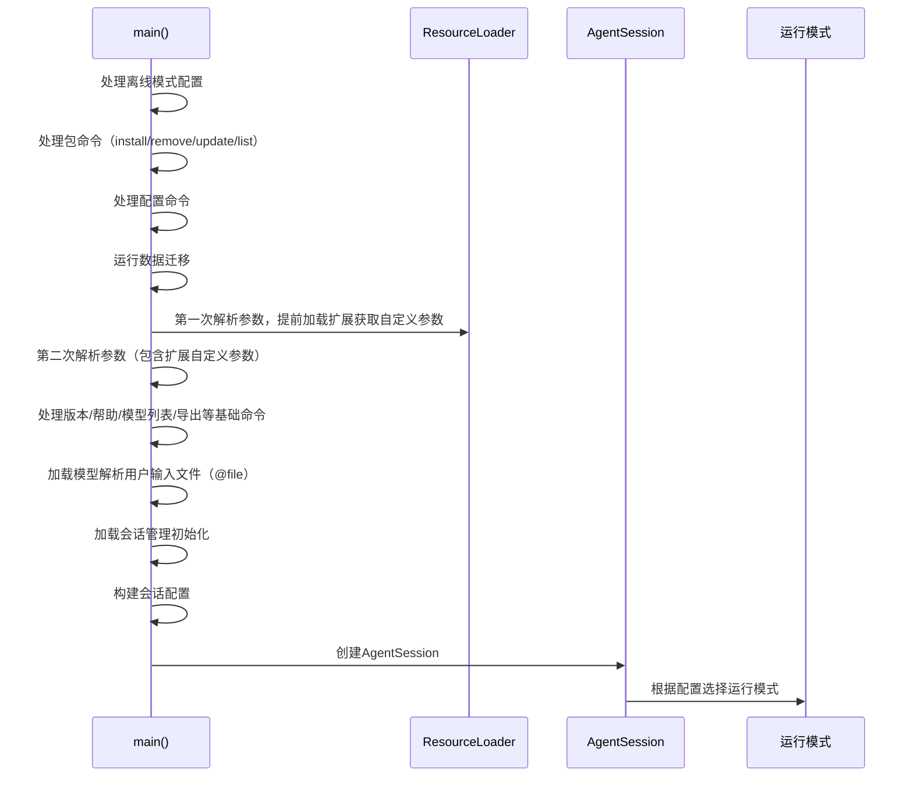

# Pi CLI 实现全解析

## 整体架构
Pi CLI 采用三层架构设计：
```mermaid
flowchart TD
    A[用户输入命令行参数] --> B[cli.ts: 入口层<br/>初始化运行时全局配置]
    B --> C[main.ts: 逻辑层<br/>参数处理命令分发
    D[args.ts: 工具层<br/>参数解析+帮助文档
    C --> E[InteractiveMode]
    C --> F[PrintMode]
    C --> G[RpcMode]
    C --> H[PackageCommand: install/remove/update/list]
    C --> I[ConfigCommand]
    C --> J[Export功能]
    C --> K[ListModels功能]
```

## 一、入口文件 [packages/coding-agent/src/cli.ts
### 核心实现
```typescript
#!/usr/bin/env node
process.title = "pi";

import { setBedrockProviderModule } from "@mariozechner/pi-ai";
import { bedrockProviderModule } from "@mariozechner/pi-ai/bedrock-provider";
import { EnvHttpProxyAgent, setGlobalDispatcher } from "undici";
import { main } from "./main.js";

// 全局配置初始化
setGlobalDispatcher(new EnvHttpProxyAgent()); // 系统代理支持
setBedrockProviderModule(bedrockProviderModule); // Bedrock动态加载，减小核心函数
main(process.argv.slice(2)); // 调用主逻辑入口
```

## 二、参数解析 [packages/coding-agent/src/cli/args.ts
### 核心功能
1. **参数定义：支持30+ CLI参数解析
2. **扩展支持：支持插件自定义参数
3. **帮助文档：自动生成完整的帮助输出
4. **类型安全：所有参数都有完整的类型定义

### 核心函数
#### 1. parseArgs() - 参数解析函数
```typescript
export function parseArgs(
  args: string[],
  extensionFlags?: Map<string, { type: "boolean" | "string" }>
): Args {
  // 支持：30+ 参数的解析逻辑
  // 支持文件参数自动识别@前缀
  // 支持扩展插件注册的自定义参数
  // 自动验证参数合法性
}
```
#### 2. printHelp() - 帮助文档生成
自动生成包含所有参数说明、示例、环境变量、可用工具等完整帮助内容。

### 核心参数列表
| 参数分类 | 参数 | 功能 |
|---------|------|------|
| 基础信息 | `--help/-h` | 显示帮助 |
| | `--version/-v` | 显示版本 |
| 模型配置 | `--provider` | 指定LLM提供商 |
| | `--model` | 指定模型ID/模式 |
| | `--api-key` | 指定API密钥 |
| | `--thinking` | 思考等级：off/minimal/low/medium/high/xhigh |
| 会话管理 | `--continue/-c` | 继续上一会话 |
| | `--resume/-r` | 选择会话恢复 |
| | `--session` | 指定会话文件 |
| | `--no-session` | 不保存会话（临时） |
| 运行模式 | `--mode` | 输出模式：text/json/rpc |
| | `--print/-p` | 非交互模式，执行完退出 |
| 功能开关 | `--no-tools` | 禁用所有工具 |
| | `--tools` | 指定启用工具列表 |
| | `--no-extensions` | 禁用扩展插件 |
| | `--extension/-e` | 加载指定扩展 |
| 其他 | `--export` | 将会话导出为HTML |
| | `--list-models` | 列出所有可用模型 |
| | `--verbose` | 详细输出 |
| | `--offline` | 离线模式 |

## 三、主逻辑 [packages/coding-agent/src/main.ts
### 核心执行流程

### 关键场景实现
#### 1. 包管理命令
支持扩展/移除/更新/列表命令
```typescript
// 命令示例
> pi install git:github.com/user/repo
> pi remove npm:@foo/bar
> pi update
> pi list
```
核心实现：handlePackageCommand()函数，处理扩展包的安装、移除、更新、列表功能，支持全局和项目级别的扩展管理。
#### 2. 会话恢复
```typescript
async function resolveSessionPath(
  sessionArg: string, 
  cwd: string, 
  sessionDir?: string
): Promise<ResolvedSession> {
  // 支持直接路径解析
  // 支持会话ID前缀匹配
  // 支持跨项目会话fork
}
```
- 直接指定会话文件路径
- 会话ID前缀自动匹配
- 跨项目会话fork支持
#### 3. 文件参数处理
```typescript
async function processFileArguments(
  fileArgs: string[],
  options: { autoResizeImages: boolean }
): Promise<{ text: string; images: ImageContent[] }> {
  // 自动处理@前缀的文件参数
  // 支持文本文件、图片文件
  // 图片自动压缩适配LLM要求
}
```
#### 4. 多模式运行
- **InteractiveMode**：默认交互模式，终端UI
- **PrintMode**：非交互模式，执行完成退出
- **RpcMode**：远程调用模式，用于IDE集成
## 四、单元测试 [packages/coding-agent/test/args.test.ts
### 测试覆盖范围
1. **基础参数测试**
```typescript
test("parses --version flag", () => {
  const result = parseArgs(["--version"]);
  expect(result.version).toBe(true);
});
test("parses --model", () => {
  const result = parseArgs(["--model", "gpt-4o"]);
  expect(result.model).toBe("gpt-4o");
});
```
2. **复合参数测试**
```typescript
test("parses multiple flags together", () => {
  const result = parseArgs([
    "--provider", "anthropic",
    "--model", "claude-sonnet",
    "--print",
    "--thinking", "high",
    "@prompt.md",
    "Do the task",
  ]);
  expect(result.provider).toBe("anthropic");
  expect(result.model).toBe("claude-sonnet");
  expect(result.print).toBe(true);
  expect(result.thinking).toBe("high");
  expect(result.fileArgs).toEqual(["prompt.md"]);
  expect(result.messages).toEqual(["Do the task"]);
});
```
3. **文件参数测试
```typescript
test("parses mixed messages and file args", () => {
  const result = parseArgs(["@file.txt", "explain this", "@image.png"]);
  expect(result.fileArgs).toEqual(["file.txt", "image.png"]);
  expect(result.messages).toEqual(["explain this"]);
});
```
4. **工具参数测试**
```typescript
test("parses --tools with valid tools", () => {
  const result = parseArgs(["--tools", "read,bash,edit"]);
  expect(result.tools).toEqual(["read", "bash", "edit"]);
});
```
## 五、典型使用场景
### 1. 基础交互模式
```bash
> pi
```
### 2. 非交互模式直接执行任务
```bash
> pi -p "List all .ts files in src/"
```
### 3. 指定模型和思考等级
```bash
> pi --model claude-3-5-sonnet --thinking high "Solve this complex problem"
```
### 4. 包含文件参数
```bash
> pi @README.md @src/main.ts "Explain this project"
```
### 5. 扩展管理
```bash
> pi install git:github.com/user/pi-extension-plan
> pi list
> pi update
```
## 关键代码路径
| 功能 | 文件路径 |
|------|----------|
| 入口文件 | [packages/coding-agent/src/cli.ts](file:///d:/prj/pi-mono-analysis/packages/coding-agent/src/cli.ts) |
| 参数解析 | [packages/coding-agent/src/cli/args.ts](file:///d:/prj/pi-mono-analysis/packages/coding-agent/src/cli/args.ts) |
| 主逻辑 | [packages/coding-agent/src/main.ts](file:///d:/prj/pi-mono-analysis/packages/coding-agent/src/main.ts) |
| 参数测试 | [packages/coding-agent/test/args.test.ts](file:///d:/prj/pi-mono-analysis/packages/coding-agent/test/args.test.ts) |
| 文件处理 | [packages/coding-agent/src/cli/file-processor.ts](file:///d:/prj/pi-mono-analysis/packages/coding-agent/src/cli/file-processor.ts) |
| 模型列表 | [packages/coding-agent/src/cli/list-models.ts](file:///d:/prj/pi-mono-analysis/packages/coding-agent/src/cli/list-models.ts) |
| 会话选择 | [packages/coding-agent/src/cli/session-picker.ts](file:///d:/prj/pi-mono-analysis/packages/coding-agent/src/cli/session-picker.ts) |
