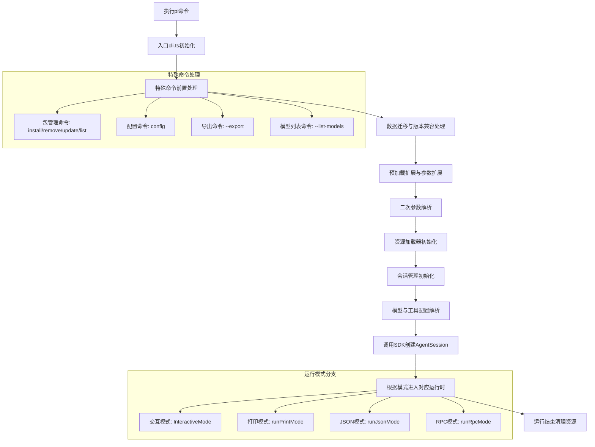

# Pi CLI 启动流程深度分析

### 启动完整流程图


---

### 启动步骤详细解析

#### 1. 入口初始化（cli.ts）
```typescript
// 全局环境配置
process.title = "pi";
setGlobalDispatcher(new EnvHttpProxyAgent()); // 全局HTTP代理支持
setBedrockProviderModule(bedrockProviderModule); // 加载Bedrock可选依赖

// 传入命令行参数，进入主逻辑
main(process.argv.slice(2));
```
**核心作用**：
- 设置进程标题，方便系统监控
- 配置全局HTTP代理，支持企业网络环境
- 动态加载可选依赖（如Bedrock Provider），减小核心包体积
- 剥离node执行路径和脚本路径，传入实际用户参数

---

#### 2. 特殊命令前置处理
```typescript
if (await handlePackageCommand(args)) {
    return; // 处理包管理命令后直接退出
}
if (await handleConfigCommand(args)) {
    return; // 处理config命令后直接退出
}
if (parsed.export) {
    await exportFromFile(parsed.export[0], parsed.export[1]);
    process.exit(0);
}
if (parsed.listModels) {
    await listModels(modelRegistry, parsed.listModels);
    process.exit(0);
}
```
**关键特性**：
- **包管理命令**：独立处理`pi install/remove/update/list`，无需初始化完整Agent
- **配置命令**：`pi config` 启动可视化配置界面，直接操作settings.json
- **导出命令**：`pi --export` 将会话导出为HTML，无需启动完整交互界面
- **模型列表命令**：`pi --list-models` 列出所有可用模型，直接返回结果

这些命令不需要完整的Agent初始化，提前处理可大幅提升响应速度。

---

#### 3. 数据迁移与扩展预加载
```typescript
// 运行跨版本数据迁移
const { migratedAuthProviders: migratedProviders, deprecationWarnings } = runMigrations(process.cwd());

// 首次参数解析，获取扩展路径等参数
const firstPass = parseArgs(args);

// 预加载扩展，获取扩展自定义的CLI参数定义
const resourceLoader = new DefaultResourceLoader({
    additionalExtensionPaths: firstPass.extensions,
    additionalSkillPaths: firstPass.skills,
    noExtensions: firstPass.noExtensions,
    /* 其他配置 */
});
await resourceLoader.reload();

// 应用扩展注册的自定义Provider
for (const { name, config } of extensionsResult.runtime.pendingProviderRegistrations) {
    modelRegistry.registerProvider(name, config);
}

// 收集扩展自定义的CLI参数
const extensionFlags = new Map<string, { type: "boolean" | "string" }>();
for (const ext of extensionsResult.extensions) {
    for (const [name, flag] of ext.flags) {
        extensionFlags.set(name, { type: flag.type });
    }
}
```
**核心逻辑**：
- 数据迁移：自动升级旧版本的配置文件、认证信息、会话格式，保证向前兼容
- 扩展预加载：优先加载扩展，获取扩展自定义的CLI参数，确保二次解析能识别扩展参数
- 动态Provider注册：扩展可以注册自定义LLM Provider，在模型解析阶段就可以使用

---

#### 4. 二次参数解析
```typescript
// 包含扩展自定义参数的完整解析
const parsed = parseArgs(args, extensionFlags);

// 扩展参数处理
for (const ext of extensionsResult.extensions) {
    if (ext.handlers.has("cli_args")) {
        for (const handler of ext.handlers.get("cli_args")!) {
            await handler({ args: parsed.extensionArgs });
        }
    }
}
```
**设计亮点**：
- 两次解析机制：第一次仅解析核心参数（扩展路径等），第二次解析包含所有扩展自定义参数
- 扩展可以完全自定义CLI参数，无缝融入原生命令行体验
- 扩展参数会传入对应的`cli_args`钩子，由扩展自行处理

---

#### 5. 会话管理初始化
```typescript
async function createSessionManager(parsed: Args, cwd: string, extensions: LoadExtensionsResult) {
    if (parsed.noSession) {
        return SessionManager.inMemory(); // 临时会话，不持久化
    }
    
    // 扩展可以自定义会话存储目录
    let effectiveSessionDir = parsed.sessionDir || await callSessionDirectoryHook(extensions, cwd);
    
    if (parsed.session) {
        // 支持通过会话ID前缀、文件路径两种方式指定会话
        const resolved = await resolveSessionPath(parsed.session, cwd, effectiveSessionDir);
        switch (resolved.type) {
            case "path": case "local": return SessionManager.open(resolved.path);
            case "global": 
                // 跨项目会话自动fork，不修改原会话
                const shouldFork = await promptConfirm("Fork this session into current directory?");
                return shouldFork ? SessionManager.forkFrom(resolved.path, cwd) : process.exit(0);
        }
    }
    if (parsed.continue) {
        return SessionManager.continueRecent(cwd, effectiveSessionDir); // 继续最近会话
    }
    if (parsed.resume) {
        return selectSession(cwd, effectiveSessionDir); // 可视化选择历史会话
    }
}
```
**会话能力**：
- 多种会话模式：临时内存会话、新持久化会话、继续最近会话、指定会话ID、可视化选择会话
- 跨项目会话自动fork机制，避免意外修改其他项目的历史会话
- 支持扩展自定义会话存储目录，适配特殊部署需求

---

#### 6. 模型与工具配置解析
```typescript
// 支持三种模型指定方式
// 1. --provider openai --model gpt-4o
// 2. --model openai/gpt-4o
// 3. --model gpt-4o:high (指定思考等级)
const resolved = resolveCliModel({
    cliProvider: parsed.provider,
    cliModel: parsed.model,
    modelRegistry,
});

// 工具配置
if (parsed.noTools) {
    options.tools = parsed.tools ? parsed.tools.map(name => allTools[name]) : [];
} else if (parsed.tools) {
    options.tools = parsed.tools.map(name => allTools[name]);
}
```
**灵活配置**：
- 模型指定支持多种简写格式，符合不同用户使用习惯
- 支持`:thinkingLevel`后缀快速指定思考等级，无需单独传参
- 工具配置灵活：`--no-tools`禁用所有工具，`--tools read,write`仅启用指定工具

---

#### 7. AgentSession 创建与模式启动
```typescript
// 调用SDK创建会话，复用SDK初始化逻辑
const { session, extensionsResult, modelFallbackMessage } = await createAgentSession(options);

// 根据运行模式进入不同处理
if (parsed.mode === "rpc") {
    await runRpcMode(session); // RPC模式，通过stdin/stdout通信
} else if (parsed.mode === "json") {
    await runJsonMode(session, parsed, initialMessage, initialImages); // JSON输出模式
} else if (parsed.print || parsed.messages.length > 0 || initialMessage) {
    await runPrintMode(session, parsed, initialMessage, initialImages); // 一次性打印模式
} else {
    // 默认进入交互模式
    const keybindingsManager = await KeybindingsManager.create();
    const interactiveMode = new InteractiveMode({
        session,
        settingsManager,
        keybindingsManager,
        extensionsResult,
        modelFallbackMessage,
        /* 其他配置 */
    });
    await interactiveMode.run();
}
```
**架构优势**：
- CLI层完全复用SDK的`createAgentSession`能力，避免重复实现
- 四种运行模式共享同一份会话核心逻辑，保证行为一致性
- 交互模式单独封装，包含完整的TUI界面、快捷键处理、渲染逻辑

---

### 关键架构设计亮点

#### 1. 分层清晰的职责划分
| 层级 | 职责 | 代码位置 |
|------|------|---------|
| CLI入口层 | 参数解析、特殊命令处理、模式分发 | `cli.ts`、`main.ts` |
| SDK核心层 | 会话初始化、Agent运行、工具执行 | `core/sdk.ts`、`core/agent-session.ts` |
| 模式实现层 | 不同运行模式的具体交互逻辑 | `modes/interactive/`、`modes/print/`等 |

#### 2. 扩展优先的设计
- 扩展加载早于大部分核心逻辑，允许扩展修改后续所有流程
- 扩展可以自定义CLI参数、会话目录、Provider、工具等几乎所有能力
- 扩展钩子贯穿整个启动流程，无需修改核心代码即可实现高度定制

#### 3. 渐进式初始化
- 非核心功能按需加载，特殊命令无需初始化完整Agent，启动速度快
- 资源加载采用懒加载策略，提升首屏响应速度
- 错误提前处理，在初始化早期发现问题并给出清晰提示，避免启动到一半失败

#### 4. 高度灵活的配置优先级
配置优先级从高到低：
1. 命令行参数（--model、--thinking等）
2. 项目级配置（./.pi/settings.json）
3. 全局用户配置（~/.pi/agent/settings.json）
4. 系统默认值

这种设计兼顾了灵活性和易用性，用户可以根据场景选择不同的配置方式。

---

### 常见启动流程问题排查
1. **启动慢**：检查是否加载了过多扩展，默认资源扫描会遍历多个目录，可使用`--no-extensions`等参数禁用不需要的资源
2. **模型找不到**：检查API Key是否正确配置，自定义Provider是否在扩展中正确注册
3. **会话加载失败**：会话文件可能损坏，可通过`pi --session <path>`指定完整路径尝试加载
4. **扩展不生效**：检查扩展路径是否正确，是否有语法错误，启动日志会输出扩展加载错误
