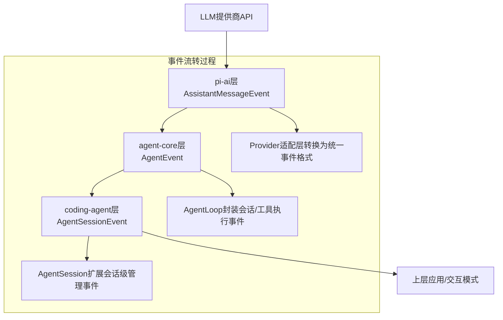
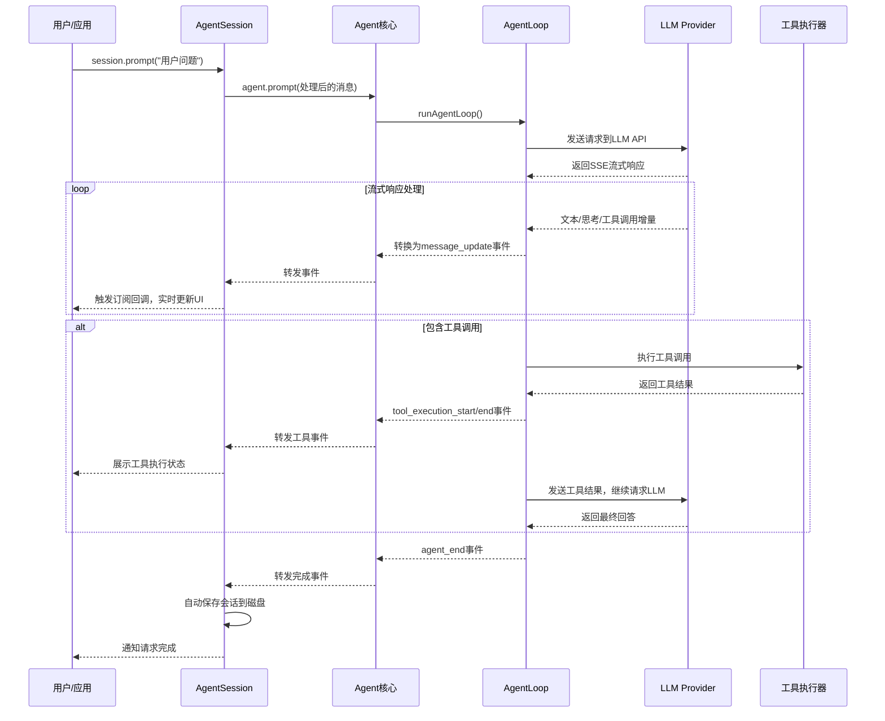

# Pi 与 LLM 对接事件体系全解析

Pi 采用三层事件架构实现与 LLM 的对接，从底层 LLM 原始响应到上层应用交互，形成完整的事件流转链路：



---

## 一、各层事件详细说明

### 1. 底层：pi-ai 层 - AssistantMessageEvent
**定义位置**：[packages/ai/src/types.ts#L233-L268](file:///d:/prj/pi-mono-analysis/packages/ai/src/types.ts#L233)
这是与 LLM 对接的最底层事件，所有 LLM 提供商的原始响应都会被转换为统一格式的事件：

| 事件类型 | 触发时机 | 核心属性 |
|---------|---------|---------|
| `start` | 流式响应开始 | `partial`: 初始空的AssistantMessage结构 |
| `text_start` | 文本块开始输出 | `contentIndex`: 内容块索引 |
| `text_delta` | 文本内容增量 | `delta`: 新增文本内容，`contentIndex` |
| `text_end` | 文本块输出完成 | `content`: 完整文本内容，`contentIndex` |
| `thinking_start` | 思考过程开始输出 | `contentIndex` |
| `thinking_delta` | 思考内容增量 | `delta`: 新增思考内容 |
| `thinking_end` | 思考过程输出完成 | `content`: 完整思考内容 |
| `toolcall_start` | 工具调用开始 | `contentIndex` |
| `toolcall_delta` | 工具参数增量输出 | `partial.content[contentIndex]`: 部分解析的参数 |
| `toolcall_end` | 工具调用参数输出完成 | `toolCall`: 完整的工具调用对象 |
| `done` | 响应完全结束 | `reason`: 停止原因，`message`: 完整的AssistantMessage |
| `error` | 响应出错 | `error`: 错误信息，`message`: 已接收的部分内容 |

**核心实现**：[packages/ai/src/utils/event-stream.ts](file:///d:/prj/pi-mono-analysis/packages/ai/src/utils/event-stream.ts)
所有 Provider 都会返回 `AssistantMessageEventStream`，实现异步迭代：
```typescript
// 示例：直接处理底层LLM事件
import { stream, getModel } from "@mariozechner/pi-ai";
const model = getModel("anthropic", "claude-3-5-sonnet");
const eventStream = stream(model, { messages: [{ role: "user", content: "Hello" }] });

for await (const event of eventStream) {
    switch (event.type) {
        case "text_delta":
            process.stdout.write(event.delta);
            break;
        case "toolcall_end":
            console.log(`调用工具: ${event.toolCall.name}`);
            break;
    }
}
const finalMessage = await eventStream.result();
```

---

### 2. 中间层：agent-core 层 - AgentEvent
**定义位置**：[packages/agent/src/types.ts#L268-L310](file:///d:/prj/pi-mono-analysis/packages/agent/src/types.ts#L268)
Agent 运行时封装的事件，在底层 LLM 事件基础上增加了会话生命周期、工具执行等逻辑：

| 分类 | 事件类型 | 触发时机 |
|------|---------|---------|
| Agent生命周期 | `agent_start` | Agent开始处理请求 |
| | `agent_end` | Agent处理完成，包含所有新生成的消息 |
| Turn生命周期 | `turn_start` | 新一轮请求开始（一次LLM调用+工具执行） |
| | `turn_end` | 本轮请求完成，包含助理消息和工具结果 |
| 消息生命周期 | `message_start` | 新消息开始（用户/助理/工具结果消息） |
| | `message_update` | 助理消息流式更新 |
| | `message_end` | 消息处理完成 |
| 工具执行 | `tool_execution_start` | 工具开始执行 |
| | `tool_execution_update` | 工具执行进度更新（流式工具） |
| | `tool_execution_end` | 工具执行完成 |

**核心实现**：[packages/agent/src/agent-loop.ts](file:///d:/prj/pi-mono-analysis/packages/agent/src/agent-loop.ts)
AgentLoop 负责将底层 LLM 事件转换为 Agent 事件，并处理工具执行逻辑：
```typescript
// 核心事件处理逻辑
async function runLoop(/* ... */) {
    // 发送请求到LLM，获取底层事件流
    const assistantStream = streamFn ? streamFn(/* ... */) : streamSimple(/* ... */);
    
    for await (const event of assistantStream) {
        if (event.type === "text_delta" || event.type === "thinking_delta" || event.type === "toolcall_delta") {
            // 转换为message_update事件
            await emit({
                type: "message_update",
                message: currentMessage,
                assistantMessageEvent: event,
            });
        }
        // ... 其他事件转换
    }
    
    // 工具执行事件
    await emit({
        type: "tool_execution_start",
        toolCallId: toolCall.id,
        toolName: toolCall.name,
        args: validatedArgs,
    });
    const result = await tool.execute(/* ... */);
    await emit({
        type: "tool_execution_end",
        toolCallId: toolCall.id,
        toolName: toolCall.name,
        result,
        isError: false,
    });
}
```

---

### 3. 应用层：coding-agent 层 - AgentSessionEvent
**定义位置**：[packages/coding-agent/src/core/agent-session.ts#L109-L124](file:///d:/prj/pi-mono-analysis/packages/coding-agent/src/core/agent-session.ts#L109)
在 AgentEvent 基础上扩展了会话管理相关的事件：

| 事件类型 | 触发时机 |
|---------|---------|
| `auto_compaction_start` | 自动上下文压缩开始 |
| `auto_compaction_end` | 自动上下文压缩完成 |
| `auto_retry_start` | 请求失败自动重试开始 |
| `auto_retry_end` | 自动重试完成 |

**核心实现**：[packages/coding-agent/src/core/agent-session.ts#L376](file:///d:/prj/pi-mono-analysis/packages/coding-agent/src/core/agent-session.ts#L376)
AgentSession 负责事件的分发、持久化和扩展通知：
```typescript
// 事件处理核心逻辑
private _handleAgentEvent = (event: AgentEvent): void => {
    // 事件异步队列保证顺序执行
    this._agentEventQueue = this._agentEventQueue.then(
        () => this._processAgentEvent(event),
        () => this._processAgentEvent(event),
    );
};

private async _processAgentEvent(event: AgentEvent): Promise<void> {
    // 1. 先通知扩展处理事件
    await this._emitExtensionEvent(event);
    
    // 2. 通知上层订阅者
    this._emit(event as AgentSessionEvent);
    
    // 3. 自动持久化消息
    if (event.type === "message_end") {
        this.sessionManager.appendMessage(event.message);
    }
    
    // 4. 自动压缩、重试等会话逻辑处理
    if (event.type === "agent_end") {
        this._checkAutoCompaction();
        this._checkAutoRetry(event);
    }
}
```

---

## 二、完整事件流转全流程



---

## 三、关键代码路径与核心实现

### 1. Provider 层事件生成（以OpenAI为例）
**代码位置**：[packages/ai/src/providers/openai-responses.ts](file:///d:/prj/pi-mono-analysis/packages/ai/src/providers/openai-responses.ts)
```typescript
export const streamOpenAIResponses: StreamFunction = (model, context, options) => {
    const stream = new AssistantMessageEventStream();
    
    (async () => {
        const output: AssistantMessage = { /* 初始空消息 */ };
        stream.push({ type: "start", partial: output }); // 触发start事件
        
        const openaiStream = await client.responses.create(params);
        for await (const chunk of openaiStream) {
            if (chunk.type === "response.output_text.delta") {
                // 转换为统一的text_delta事件
                output.content[0].text += chunk.delta;
                stream.push({
                    type: "text_delta",
                    contentIndex: 0,
                    delta: chunk.delta,
                    partial: output,
                });
            }
            // ... 其他事件类型处理
        }
        
        stream.push({ type: "done", reason: "stop", message: output }); // 触发done事件
    })();
    
    return stream;
};
```

### 2. AgentLoop 事件流转
**代码位置**：[packages/agent/src/agent-loop.ts#L179](file:///d:/prj/pi-mono-analysis/packages/agent/src/agent-loop.ts#L179)
```typescript
async function streamAssistantResponse(/* ... */) {
    const stream = streamFn ? streamFn(/* ... */) : streamSimple(model, llmContext, options);
    
    for await (const event of stream) {
        switch (event.type) {
            case "start":
                currentMessage = event.partial as AssistantMessage;
                await emit({ type: "message_start", message: currentMessage });
                break;
            case "text_delta":
            case "thinking_delta":
            case "toolcall_delta":
                // 更新消息内容
                updateMessageFromEvent(currentMessage, event);
                await emit({
                    type: "message_update",
                    message: currentMessage,
                    assistantMessageEvent: event,
                });
                break;
            case "done":
                currentMessage = event.message;
                await emit({ type: "message_end", message: currentMessage });
                break;
        }
    }
    
    return currentMessage;
}
```

### 3. 上层订阅事件处理
**代码位置**：[packages/coding-agent/src/modes/interactive/interactive-mode.ts#L2089](file:///d:/prj/pi-mono-analysis/packages/coding-agent/src/modes/interactive/interactive-mode.ts#L2089)
```typescript
// 交互模式订阅事件示例
private subscribeToAgent(): void {
    this.unsubscribe = this.session.subscribe(async (event) => {
        switch (event.type) {
            case "message_update":
                if (event.assistantMessageEvent.type === "text_delta") {
                    this.chatView.appendText(event.assistantMessageEvent.delta);
                    this.ui.requestRender();
                }
                break;
            case "tool_execution_start":
                this.chatView.addToolCall(event.toolName, event.args);
                this.ui.requestRender();
                break;
            case "agent_end":
                this.updateFooter();
                break;
        }
    });
}
```

---

## 四、典型使用场景

### 1. SDK 模式订阅事件
```typescript
const { session } = await createAgentSession();
session.subscribe((event) => {
    switch (event.type) {
        // 流式输出文本
        case "message_update":
            if (event.assistantMessageEvent.type === "text_delta") {
                process.stdout.write(event.assistantMessageEvent.delta);
            }
            break;
        // 工具执行状态
        case "tool_execution_start":
            console.log(`\n[执行工具: ${event.toolName}]`);
            break;
        case "tool_execution_end":
            console.log(`[工具执行${event.isError ? "失败" : "成功"}]`);
            break;
        // 请求完成
        case "agent_end":
            console.log("\n[请求完成]");
            break;
    }
});
await session.prompt("帮我写一个快速排序算法");
```

### 2. 扩展中监听事件
```typescript
export default function (pi: ExtensionAPI) {
    pi.on("message_end", async (event) => {
        if (event.message.role === "assistant") {
            // 每次助理回答完成后做自定义处理
            await saveToKnowledgeBase(event.message);
        }
    });
    
    pi.on("tool_execution_end", async (event) => {
        // 工具调用审计
        await logToolUsage(event.toolName, event.args, event.result);
    });
}
```

---

## 五、事件架构设计亮点
1. **完全解耦**：三层事件独立，下层事件对上层透明，可单独使用任意一层
2. **统一格式**：所有 LLM 提供商的响应都转换为相同事件格式，上层无需处理厂商差异
3. **全异步流式**：所有事件都是流式的，支持实时响应，无阻塞等待
4. **可扩展**：每层都可以自定义事件，不影响其他层
5. **队列保证**：事件通过异步队列处理，严格保证顺序，不会出现乱序
