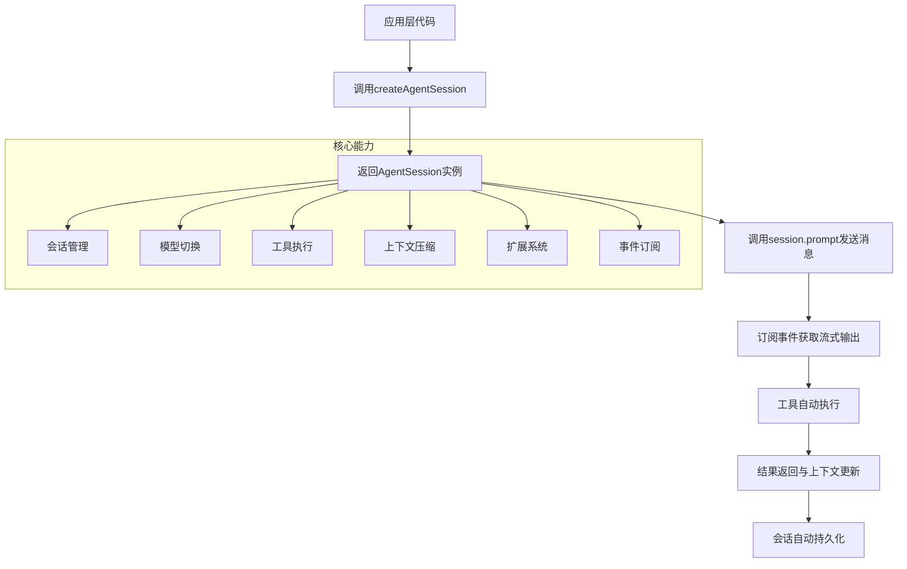
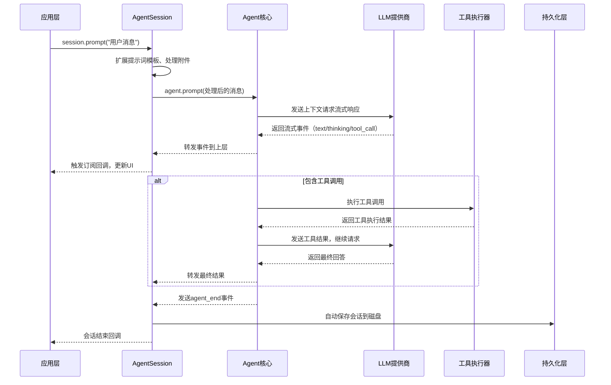

# Pi SDK 集成模式核心流程与关键实现

### 整体架构图


---

## 一、SDK 核心使用流程

### 1. 最小集成示例
```typescript
// 1. 导入核心依赖
import { createAgentSession, readTool, bashTool } from "@mariozechner/pi-coding-agent";

// 2. 创建会话（自动加载所有配置、扩展、资源）
const { session } = await createAgentSession({
    tools: [readTool, bashTool], // 启用需要的内置工具
    sessionManager: SessionManager.inMemory(), // 内存模式，不持久化
});

// 3. 订阅事件，获取流式响应
session.subscribe((event) => {
    switch (event.type) {
        case "message_update":
            if (event.assistantMessageEvent.type === "text_delta") {
                process.stdout.write(event.assistantMessageEvent.delta);
            }
            break;
        case "tool_execution_start":
            console.log(`\n[执行工具: ${event.toolName}]`);
            break;
        case "agent_end":
            console.log("\n[会话结束]");
            break;
    }
});

// 4. 发送用户消息
await session.prompt("列出当前目录下的所有文件");
```

---

## 二、核心流程详细解析

### 1. 会话创建流程
```typescript
// createAgentSession 核心步骤
const { session } = await createAgentSession({
    // 可选配置项
    cwd: "/your/project/path", // 工作目录
    model: getModel("anthropic", "claude-3-5-sonnet"), // 指定模型
    thinkingLevel: "high", // 思考等级
    tools: [readTool, writeTool], // 内置工具列表
    customTools: [yourCustomTool], // 自定义工具
    sessionManager: SessionManager.inMemory(), // 会话持久化策略
    resourceLoader: customResourceLoader, // 自定义资源加载
});
```
**关键特性**：
- **自动环境检测**：自动识别系统环境、代理设置、API Key
- **资源自动发现**：自动加载项目下的扩展、技能、提示词模板、AGENTS.md等
- **会话恢复**：自动从持久化存储恢复历史会话
- **工具自动注册**：内置工具和扩展工具自动注册到Agent

---

### 2. 消息处理全链路

**核心流程说明**：
1. **消息预处理**：自动展开提示词模板、解析skill块、处理图片附件
2. **流式响应**：所有输出都是流式的，支持实时展示思考过程、工具调用进度
3. **工具自动执行**：内置工具和自定义工具自动执行，无需应用层处理
4. **上下文自动维护**：消息、工具结果自动追加到上下文，无需手动管理
5. **自动持久化**：所有变更自动保存到会话文件，崩溃不丢失数据

---

## 三、关键能力实现

### 1. 事件系统
```typescript
// 支持的核心事件类型
type AgentSessionEvent =
  | AgentEvent // 核心Agent事件（message_start, message_update, message_end, tool_execution_*等）
  | { type: "auto_compaction_start"; reason: "threshold" | "overflow" } // 上下文压缩开始
  | { type: "auto_compaction_end"; result: CompactionResult } // 上下文压缩结束
  | { type: "auto_retry_start"; attempt: number; maxAttempts: number } // 自动重试开始
  | { type: "auto_retry_end"; success: boolean } // 自动重试结束

// 订阅示例
const unsubscribe = session.subscribe((event) => {
    // 处理所有事件
});

// 取消订阅
unsubscribe();
```
**设计亮点**：
- 事件统一化：所有生命周期事件统一格式，上层应用无需区分来源
- 异步安全：事件队列保证顺序执行，不会出现乱序
- 自动清理：取消订阅后自动清理所有监听器，无内存泄漏

---

### 2. 工具系统
#### 内置工具直接使用
```typescript
import { 
    readTool, writeTool, editTool, bashTool, 
    grepTool, findTool, lsTool 
} from "@mariozechner/pi-coding-agent";

const { session } = await createAgentSession({
    tools: [readTool, bashTool, grepTool] // 选择需要的工具
});
```

#### 自定义工具实现
```typescript
const myCustomTool: ToolDefinition = {
    name: "get_weather",
    description: "获取指定城市的天气",
    parameters: Type.Object({
        city: Type.String({ description: "城市名称" }),
    }),
    execute: async (toolCallId, params, signal) => {
        const weather = await fetchWeatherApi(params.city);
        return {
            content: [{ type: "text", text: weather }],
            details: { city: params.city, temperature: weather.temp },
        };
    },
};

// 注册自定义工具
const { session } = await createAgentSession({
    customTools: [myCustomTool],
});
```
**工具系统特性**：
- **类型安全**：基于TypeBox的参数自动验证，错误自动返回给LLM重试
- **流式工具**：支持工具执行进度流式输出
- **工具钩子**：beforeToolCall/afterToolCall钩子，支持权限控制、审计等
- **扩展工具**：扩展注册的工具自动可用，无需额外配置

---

### 3. 会话管理能力
```typescript
// 会话操作API
// 1. 消息发送
await session.prompt("用户问题");
await session.prompt("带附件的问题", {
    images: [{ type: "image", data: base64Data, mimeType: "image/png" }]
});

// 2. 模型管理
await session.setModel(newModel);
await session.cycleModel(); // 循环切换scopedModels
const currentModel = session.agent.state.model;

// 3. 会话控制
session.abort(); // 中断当前执行
await session.waitForIdle(); // 等待会话空闲
session.clearMessages(); // 清空上下文

// 4. 分支管理
await session.fork(); // 创建新会话分支
await session.switchToBranch(entryId); // 切换到历史分支
const branchTree = session.sessionManager.getBranch(); // 获取完整分支树

// 5. 压缩管理
await session.compact("自定义压缩指令"); // 手动压缩上下文
const stats = session.getSessionStats(); // 获取会话统计（token数、成本等）
```
**高级能力**：
- **分支回溯**：会话采用树形结构，支持任意历史点回溯，不丢失上下文
- **自动压缩**：上下文溢出自动压缩，保持会话可用
- **成本统计**：自动累计token使用量和成本，可随时查询
- **多会话隔离**：多个AgentSession实例完全隔离，互不影响

---

### 4. 扩展系统集成
扩展在SDK模式下完全可用，无需额外配置：
```typescript
const { session } = await createAgentSession({
    // 加载指定扩展
    resourceLoader: new DefaultResourceLoader({
        additionalExtensionPaths: ["/path/to/your/extension"],
    }),
});
```
扩展能力在SDK模式下完全兼容：
- 自定义工具、命令、事件钩子自动生效
- 扩展可以修改上下文、拦截工具调用、添加自定义逻辑
- 支持动态加载/卸载扩展，无需重启会话

---

## 四、SDK 核心优势

### 1. 高度封装，开箱即用
- 无需处理LLM API差异、工具执行、会话管理等底层逻辑
- 内置完整的错误处理、重试机制、上下文管理
- 自动兼容所有Pi生态的扩展、技能、提示词模板

### 2. 灵活可定制
- 从极简模式到完全自定义，支持不同场景需求
- 可以替换任意核心组件（ResourceLoader、SessionManager等）
- 工具、模型、扩展都可以按需加载，最小化依赖

### 3. 全场景适配
- 支持嵌入式集成到CLI工具、桌面应用、Web服务等
- 内存模式适合无状态服务，持久化模式适合用户会话场景
- 多种运行模式（打印/JSON/RPC）可以复用同一套核心逻辑

---

## 五、典型集成场景

### 1. 嵌入式助手
```typescript
// 在你的CLI工具中嵌入AI能力
async function runAiHelper(userInput: string) {
    const { session } = await createAgentSession({
        sessionManager: SessionManager.inMemory(),
        tools: [readTool, bashTool],
        cwd: process.cwd(),
    });
    
    let fullResponse = "";
    session.subscribe((event) => {
        if (event.type === "message_update" && event.assistantMessageEvent.type === "text_delta") {
            fullResponse += event.assistantMessageEvent.delta;
        }
    });
    
    await session.prompt(userInput);
    return fullResponse;
}
```

### 2. 服务端多用户部署
```typescript
// 每个用户创建独立会话
const userSessions = new Map<string, AgentSession>();

async function getUserSession(userId: string) {
    if (userSessions.has(userId)) {
        return userSessions.get(userId)!;
    }
    
    const { session } = await createAgentSession({
        sessionManager: SessionManager.create(process.cwd(), `/data/sessions/${userId}`),
        tools: [readTool, writeTool],
    });
    
    userSessions.set(userId, session);
    return session;
}
```

### 3. 自定义工作流编排
```typescript
// 实现代码审查工作流
async function codeReview(filePath: string) {
    const { session } = await createAgentSession({
        tools: [readTool],
    });
    
    // 第一步：读取文件
    const code = await fs.readFile(filePath, "utf-8");
    
    // 第二步：代码审查
    await session.prompt(`审查以下代码，找出bug和性能问题：\n\`\`\`\n${code}\n\`\`\``);
    
    // 第三步：生成修复建议
    await session.prompt("针对上述问题，生成具体的修复代码");
    
    // 获取完整会话历史
    const history = session.agent.state.messages;
    return history;
}
```

SDK模式将Pi的所有核心能力都暴露为可编程API，你可以基于它快速构建任意AI Agent应用，无需重复开发底层能力。
